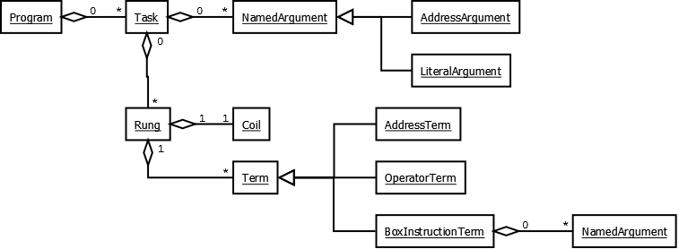

# OSPA Assembly Language

## Terminology

### Address

Format: @(Type)(Number)

Examples: @D0, @W5, @WX70

Address Type | Description
------------ | -----------
D            | Discrete Register
W            | Word Register
R            | Real Register
DX           | Discrete Input
DY           | Discrete Output
WX           | Word Input
WY           | Word Output
T            | Task

### Task
todo

## Grammar

## Abstract Syntax Tree

## Instructions

## Examples

	task @T0 ( activation: startup priority: 1 )
	{
		@D1 := yes ;
	}
	
	task @T1 ( activation: continuous priority: 5 )
	{
		@D2 := @D4 @D6 and2 @D7 or2 ;
		@D3 := @D7 @D9 @D6 or3 ;
		@D4 := @D2 @D3 or one-shot ;
	}
	
	task @T2 ( activation: manual )
	{
		@D6 := @D9 not ;
	}
