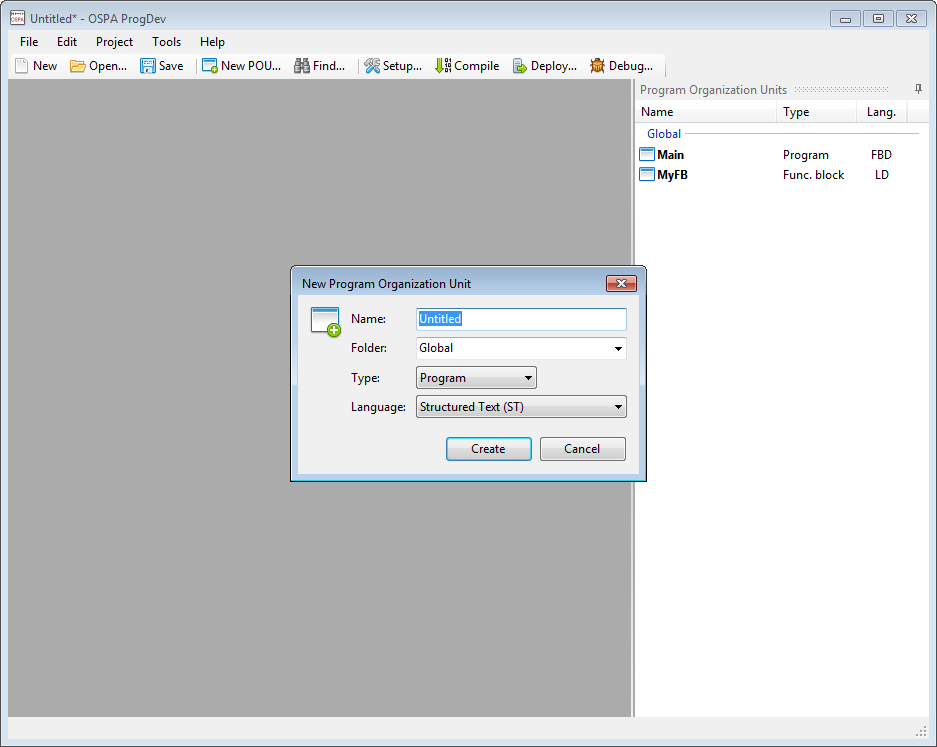

# OSPA - Open Source PLC Architecture

* [OSPA Architecture](doc/OSPA Architecture.md)
* [OSPA Chipset](doc/OSPA Chipset.md)
* [ProgDev - Programming software](ProgDev/)

(2014-04-13) Development screenshot:

Basic shell with the ability to create POUs and folders.